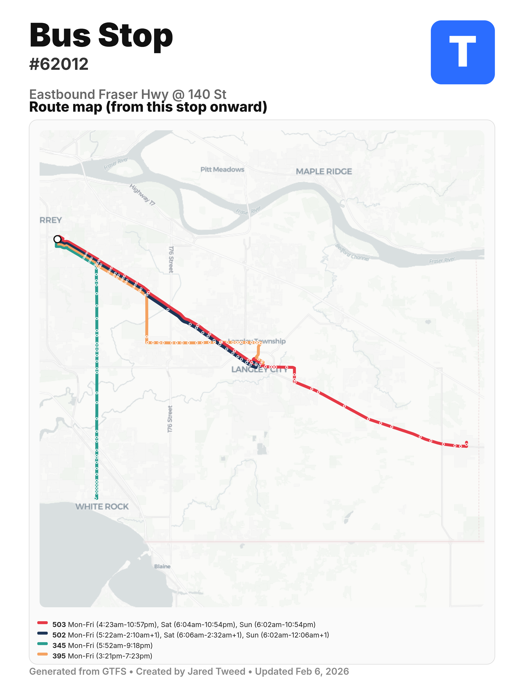
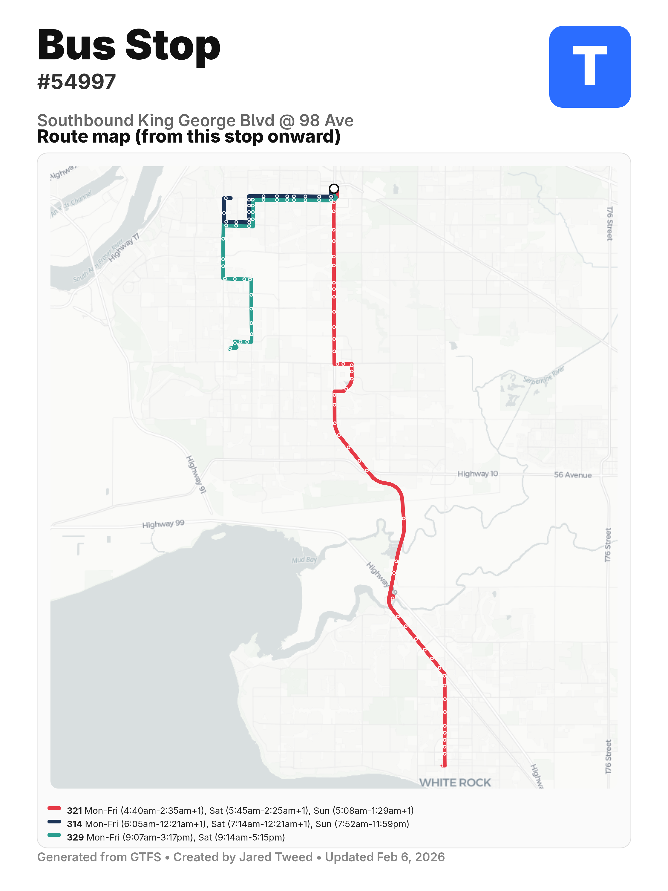
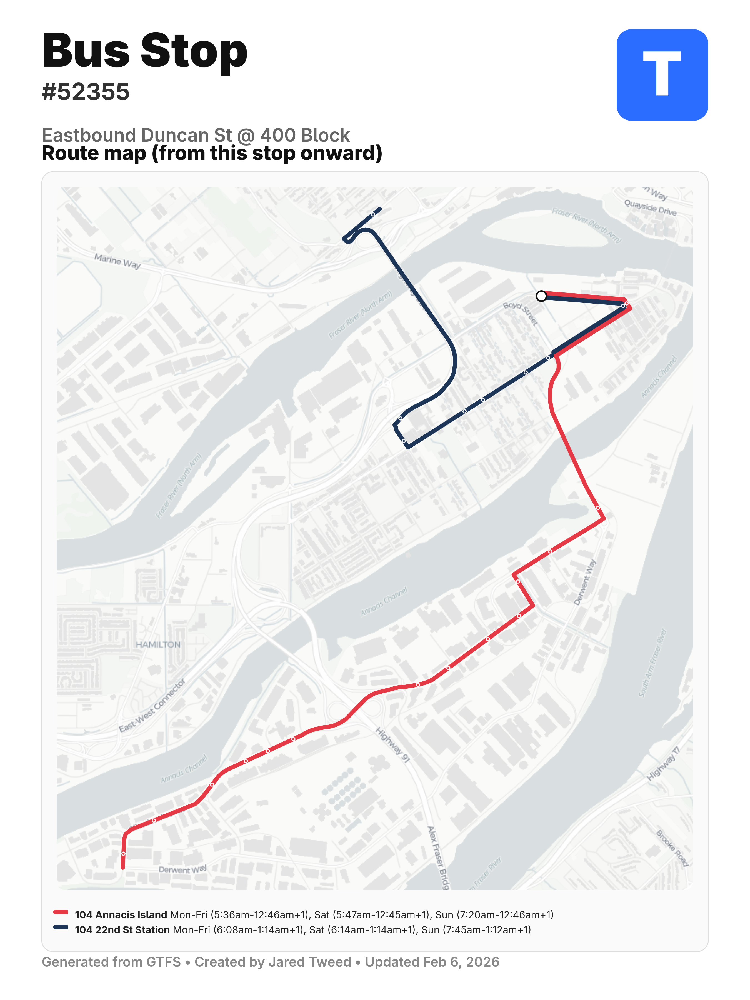

## Description

This website generates high quality bus stop signs from GTFS zip files. By default, it uses the GTFS file for Vancouver, BC's Translink. 

I heard that the largest reason for poor signage is due to the frequency of how often the routes get updated, so I wanted to create an efficient way for people to improve the signs through guerilla/tactical urbanism. I was inspired to make the website from this video:

[How to Fix Bus Stop Signs: Uytae Lee's Stories About Here](https://www.youtube.com/watch?v=0Z9gMVH-N8E)

## Examples

## TODO

- Mass download of bus signs for large areas.
- Make lines look smoother when merging or splitting.
  - Modify how the line transitions into itself after it splits off, or another line splits off from its direction. Instead of suddenly shifting the line to be accurate (which can make it look like it jumps perpendicular to its direction of movement), make it transition directly to that color's position 10px (make this a varaible I can adjust) farther down, so that when splits/merges happen, they look more gradual so that the line doesn't cut at all. Just to reiterate, 10px after a split or preceeding a merge. And if the thickness of this line changes size/thickness during this transition, make it transition its size gradually as well. If I make it transition for 20px, the continuation of it should start only once that transition is complete.